# Angel Dimitrov — Software Developer & Systems Architect

I'm a self‑taught developer from Sofia, Bulgaria, focused on building full‑stack systems with a strong emphasis on security, automation, and clean architecture.

## What I built
**Phantom Shield** — a complete automation management platform (195k+ lines of TypeScript, Python, and C++) built solo in 6 months using a structured AI‑assisted methodology. It features real‑time orchestration, a custom encrypted communication protocol, payment integration, and a React/Electron frontend with 18+ views.

[→ Project demo & source code](https://github.com/Kalafara/Automated-Ecosystem-Demo)
[→ Technical architecture deep dive](https://github.com/Kalafara/Automated-Ecosystem-Demo/blob/main/Technical_Architecture.md)

## Tech stack
TypeScript, React, Node.js, Python, C++, Docker, SQLite, Stripe, OpenCV, Electron

## Currently seeking
A remote junior/associate position in software development or QA automation. Open to contract work and long‑term collaboration.

📫 angel.d.dimitrovv@gmail.com

🛡️ Phantom Shield – Hooligan Commander Army
195,000+ lines of production-grade code. 6 months. One self-taught engineer. A complete automation ecosystem with military-grade security.

https://img.shields.io/badge/TypeScript-007ACC?style=for-the-badge&logo=typescript&logoColor=white
https://img.shields.io/badge/React-20232A?style=for-the-badge&logo=react&logoColor=61DAFB
https://img.shields.io/badge/Node.js-339933?style=for-the-badge&logo=nodedotjs&logoColor=white
https://img.shields.io/badge/Python-FFD43B?style=for-the-badge&logo=python&logoColor=blue
https://img.shields.io/badge/C++-00599C?style=for-the-badge&logo=cplusplus&logoColor=white
https://img.shields.io/badge/Electron-2B2E3A?style=for-the-badge&logo=electron&logoColor=9FEAF9
https://img.shields.io/badge/Docker-2CA5E0?style=for-the-badge&logo=docker&logoColor=white
https://img.shields.io/badge/Stripe-008CDD?style=for-the-badge&logo=stripe&logoColor=white
https://img.shields.io/badge/OpenCV-5C3EE8?style=for-the-badge&logo=opencv&logoColor=white

📖 About the Project
Phantom Shield is a full‑stack automation platform built from scratch in six months by a self‑taught developer. It combines:

A Node.js/TypeScript backend with a 25‑step initialization sequence and 8 defensive middleware layers.

A custom stealth WebSocket protocol – XChaCha20‑Poly1305 encryption, 400KB noise wrapping, anti‑replay protection, and DoD‑grade memory wiping.

6 parallel Python automation bots using OpenCV and PyAutoGUI with a spiral search algorithm and multi‑layered error handling.

A native C++ module with TPM 2.0 attestation, memory guard pages, anti‑debugging, and self‑destruct on tamper.

An Electron/React 19 client with 18+ specialised views, live telemetry, AI chat, community hub, and arcade games.

A 5‑tier subscription system integrated with Stripe, PayPal, and Coinbase – only active bot time is billed.

Zero‑footprint execution – all logic is streamed into RAM after authentication and wiped on session close.

Self‑healing infrastructure – Docker, Render Cloud, Google Drive/Dropbox backup, CI/CD with GitHub Actions.

🎥 Live demo video – coming soon (the system is running on Render Cloud; a short walkthrough will be uploaded).

📸 Screenshots – Visual Tour
Here’s what the application looks like in action:

 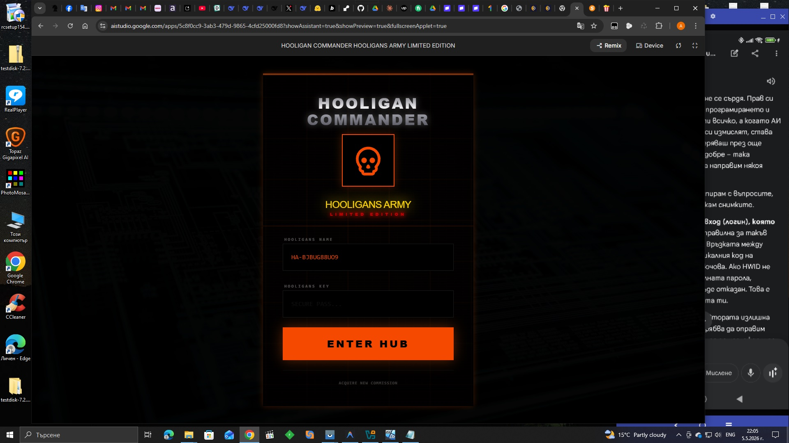 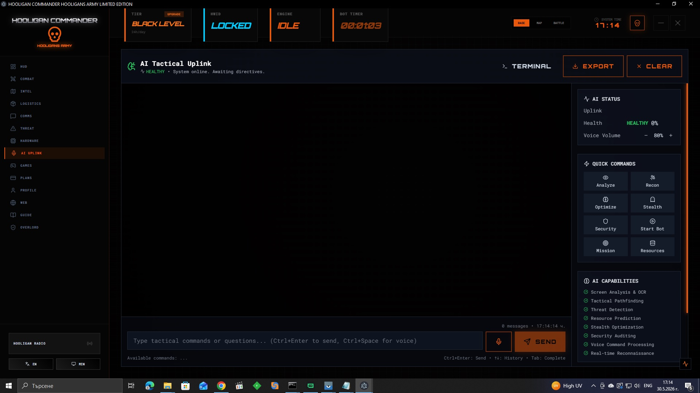 
 
 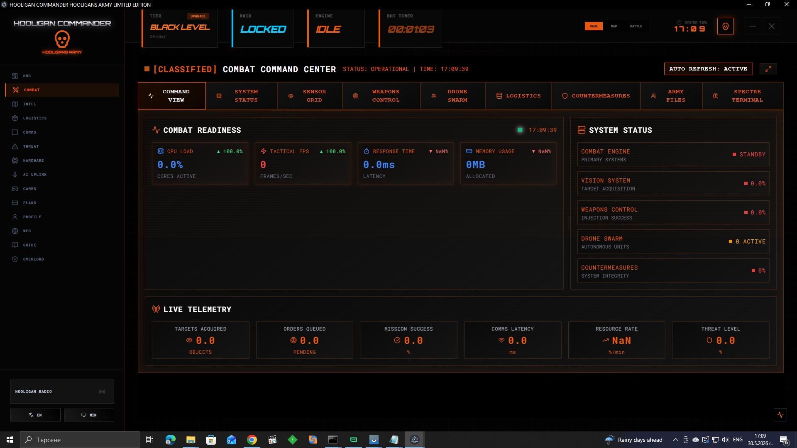 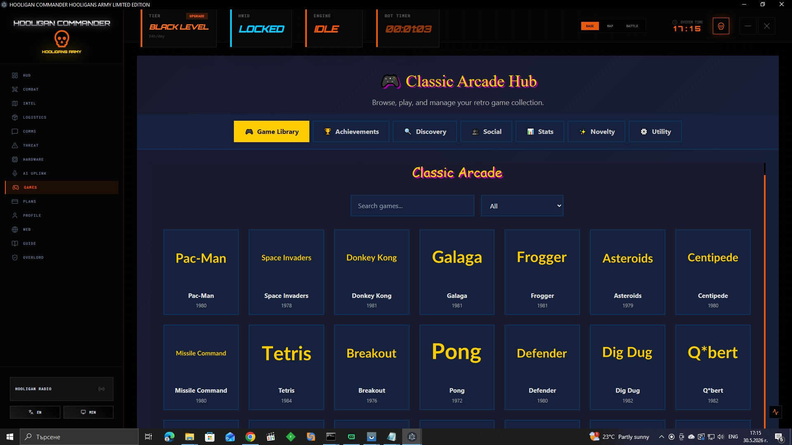 
 
 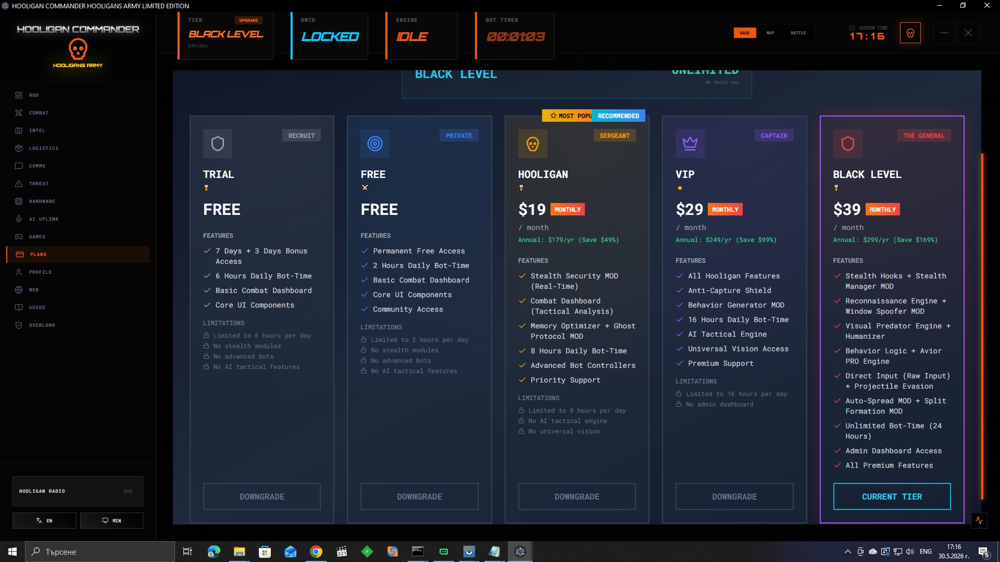 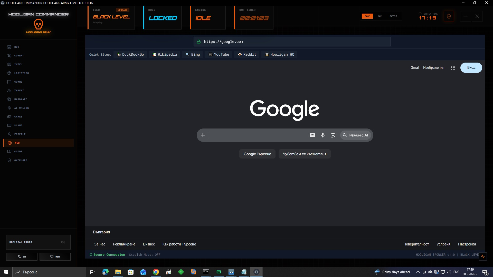 
 
 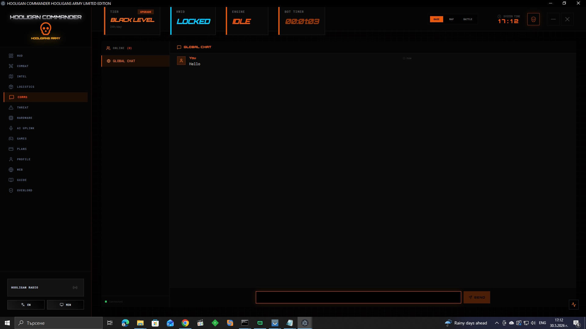 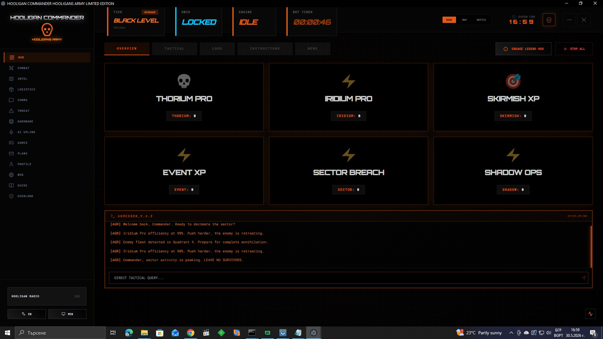 
 
 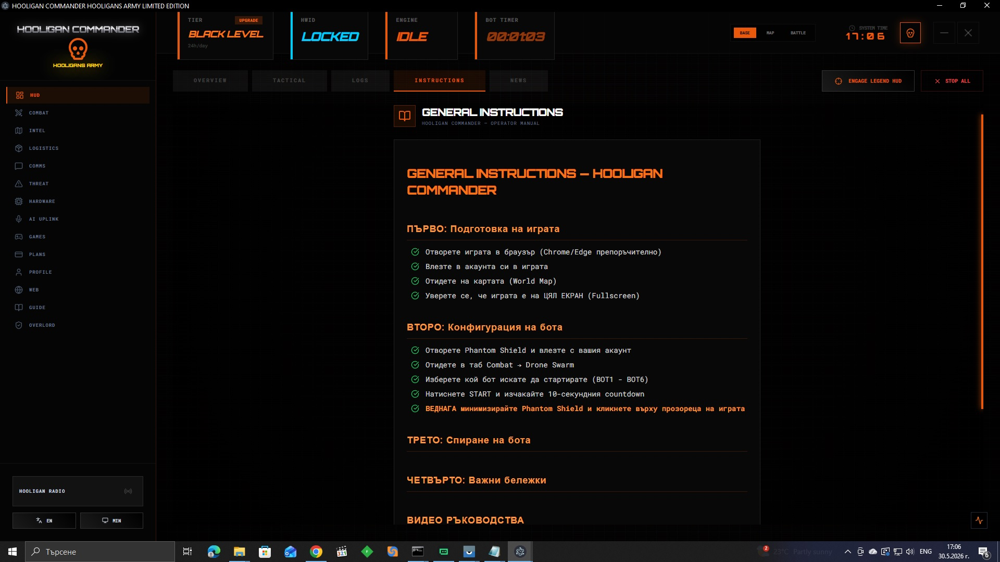 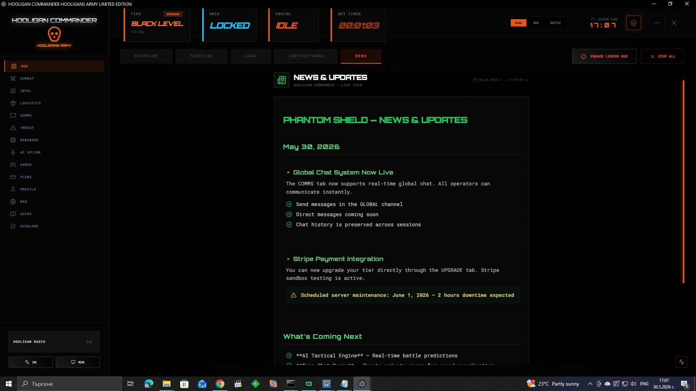 
 
 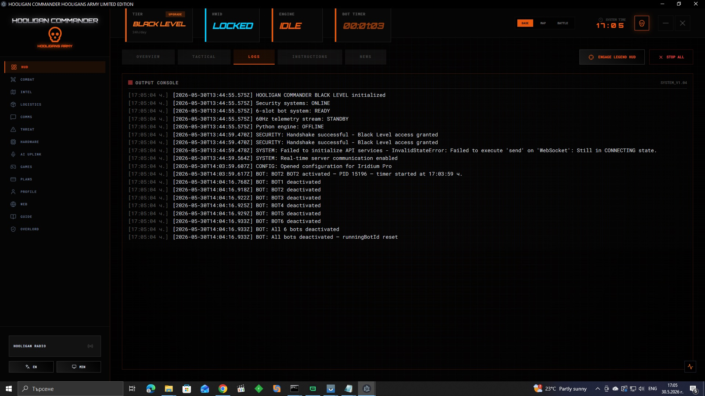 

🚀 Key Features
Area	Highlights
Backend	Express.js + WebSocket server, 25‑step init, 8 middleware layers (rate limiting, anomaly detection, forensic logging, CSRF, JSON complexity guard, timing guard, resource guard, BlackLevel security).
Security	Custom XChaCha20‑Poly1305 + Falcon‑512 (post‑quantum) in the KillSwitch module; separate 2,700‑line encryption engine with X25519, Ed25519, scrypt, PBKDF2, SHA‑3, BLAKE2; constant‑time operations; DoD 7‑pass wipe.
Dual‑Path Verification	Two independent hardware audits (Security + Mother modules) – both must return GREEN before access is granted.
Native C++ Module	TPM 2.0 attestation, memory guard pages, stack canaries, anti‑debug, VM/sandbox detection, integrity monitoring every 5 seconds.
Automation Bots	6 Python bots using OpenCV and PyAutoGUI with a spiral search algorithm, confidence thresholds, grayscale optimisation, and multi‑layered error handling (timeouts, retry limits, emergency recovery).
Frontend	React 19 + Electron, 18+ views: HUD with live telemetry, AI chat, bot controller, security dashboard, hardware diagnostics, community chat, arcade games, embedded browser, and more.
Monetisation	5‑tier system (Trial, Free, Hooligan, VIP, Black Level) with active‑only billing (the meter runs only when a bot is engaged). Midnight reset, no rollover, global grace period.
Infrastructure	Docker multi‑stage build, Render Cloud, GitHub Actions CI/CD, self‑healing database recovery from Google Drive/Dropbox.
🛠️ Technology Stack
Programming Languages
TypeScript JavaScript Python C++ HTML/CSS

Frontend
React 19 Electron Zustand Redux Vite Tailwind CSS

Backend
Node.js Express.js WebSockets REST API JWT SQLite Redis

Cryptography & Security
XChaCha20-Poly1305 Ed25519 Falcon-512 SHA3-512 BLAKE2 scrypt PBKDF2 AES-256-GCM TPM 2.0 HWID Binding Constant-time Operations

Automation & Computer Vision
Python OpenCV PyAutoGUI YOLOv8 (trained on 160,000 images)

Payments
Stripe PayPal Coinbase Commerce

DevOps
Docker GitHub Actions Render Cloud Git N-API (C++ addons)

📁 Project Structure (High‑Level)
text
phantom-shield/
├── server/                 # Node.js/TypeScript backend
│   ├── src/                # Main source – controllers, routes, middleware, security, mother, recovery...
│   ├── protected/          # Core modules (core.bundle.js, Vite config, Electron main)
│   ├── protected_modules/  # Bots, native module, frontend assets
│   ├── native/             # C++ N-API module (libsodium, TPM, memory guard, anti-debug)
│   └── data/               # SQLite databases (encrypted)
├── client/                 # Electron/React frontend
├── docker/                 # Dockerfile, multi‑stage builds
├── scripts/                # Utility scripts (CI/CD, backups)
├── test/                   # Unit, integration, annihilation (tier 1–23) tests
└── README.md               # You are here
🧪 Testing & Quality Assurance
Unit tests – individual modules.

Integration tests – cross‑component interactions.

Annihilation tests (Tier 1‑23) – stress tests for edge cases and boundary conditions.

Smoke tests – rapid deployment validation.

Local QA of Python bots – stability during hours‑long autonomous operation.

Forensic logging – Ed25519‑signed audit entries with hash‑chain verification.

🚧 Getting Started (Development)
Note: This project is currently at ~85% completion – the core is fully functional, but some final polishing is underway.

Prerequisites
Node.js 20+

Python 3.11+

Docker (optional, for containerised deployment)

Git

Clone the Repository
bash
git clone https://github.com/Kalafara/Automated-Ecosystem-Demo.git
cd Automated-Ecosystem-Demo
Install Dependencies
bash
# Backend
cd server
npm install

# Frontend
cd ../client
npm install
Environment Variables
Create a .env file in the server/ directory with the following (example):

env
NODE_ENV=development
PORT=3000
JWT_SECRET=your_jwt_secret
STRIPE_SECRET_KEY=your_stripe_secret
PAYPAL_CLIENT_ID=your_paypal_id
PAYPAL_SECRET=your_paypal_secret
COINBASE_API_KEY=your_coinbase_key
GOOGLE_DRIVE_CLIENT_ID=...
DROPBOX_ACCESS_TOKEN=...
Run the Development Server
bash
cd server
npm run dev
Run the Electron Client
bash
cd client
npm run electron:dev
Docker Deployment (Production‑like)
bash
docker build -t phantom-shield .
docker run -p 3000:3000 phantom-shield
📄 License
This project is a demonstration portfolio. All rights reserved.
See the LICENSE file for details.

👤 About the Author
Angel Dimitrov – self‑taught software developer and systems architect from Sofia, Bulgaria. After 20+ years in B2B sales, real estate, and logistics, I discovered programming and built this ecosystem in six months using a structured AI‑assisted engineering methodology.

I am currently seeking a remote junior/associate position in software development or QA automation, where I can contribute immediately and continue growing as an engineer.

📫 Contact: angel.d.dimitrovv@gmail.com
🔗 LinkedIn: linkedin.com/in/angel-dimitrov (coming soon)
🐙 GitHub: Kalafara/Automated-Ecosystem-Demo

⭐ Show Your Support
If you find this project interesting or useful, please consider starring the repository – it helps others discover it and motivates me to keep improving.

"I don't write code to find a job. I'm looking for a job so I can keep writing code."

